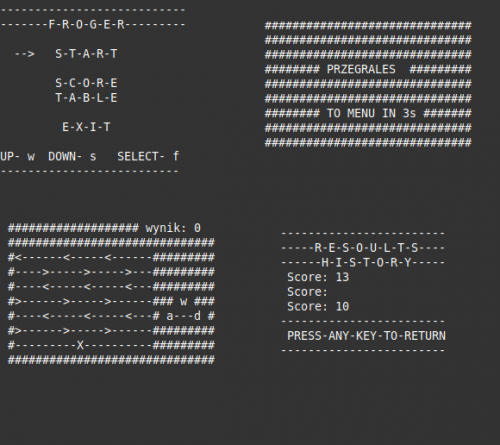

# FrogerGame 
Simple concurrent console Frogger written in Ada. Game operates on 3 main tasks (equivalent of Thread in Java) that sync and comunicate with each other. The core game-play runs on three threds each on responsible for getting input, displaying and contolling enemies.

## Tasks

* FoggerTask
  Task responsibile for capturing usere input and applying those changes to *Frog* in the game
 
 * Level
  Represents a single road line. This task steers car movement on a lane and detects eventual collisions with *Frog*. Number of *level* tasks used correspodns to specyfied number of lanes the frogger has to cross befeore reaching fisnih.
  
  * Main
    *Main* task controlls the global behavoir of program, resets all the task when game is restarted or closes when user quits game. Additional responibilty of *main* is displaying game to the player.
    
## To Build
You have to have exec/ and obj/ dirs in main folder.
As it is in project file: froger.gpr

    $ gprbuild -P froger
  

## To Run 
    $ "exec/main.exe"
    or
    $ ./exec/main
